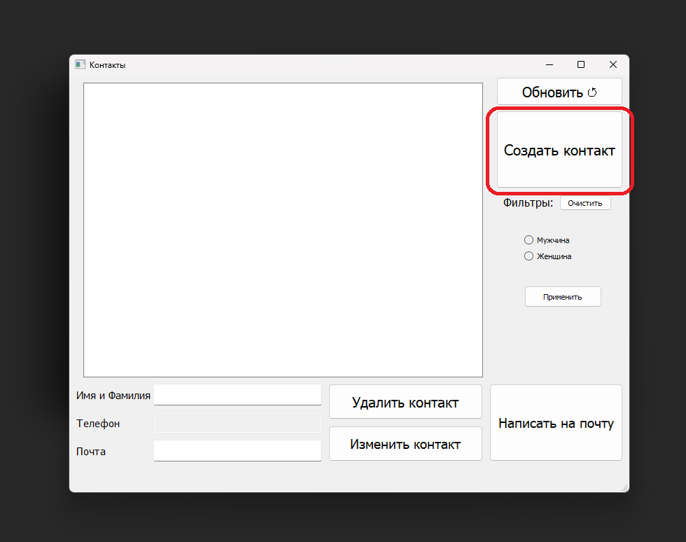
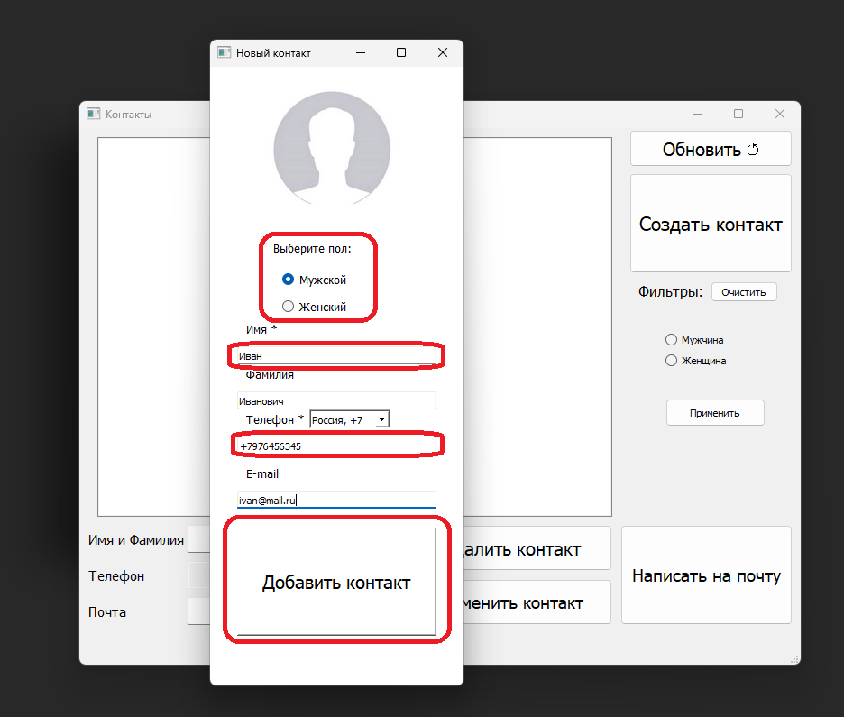
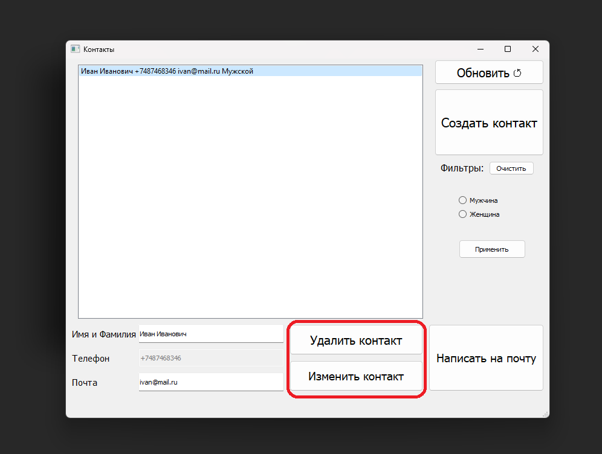
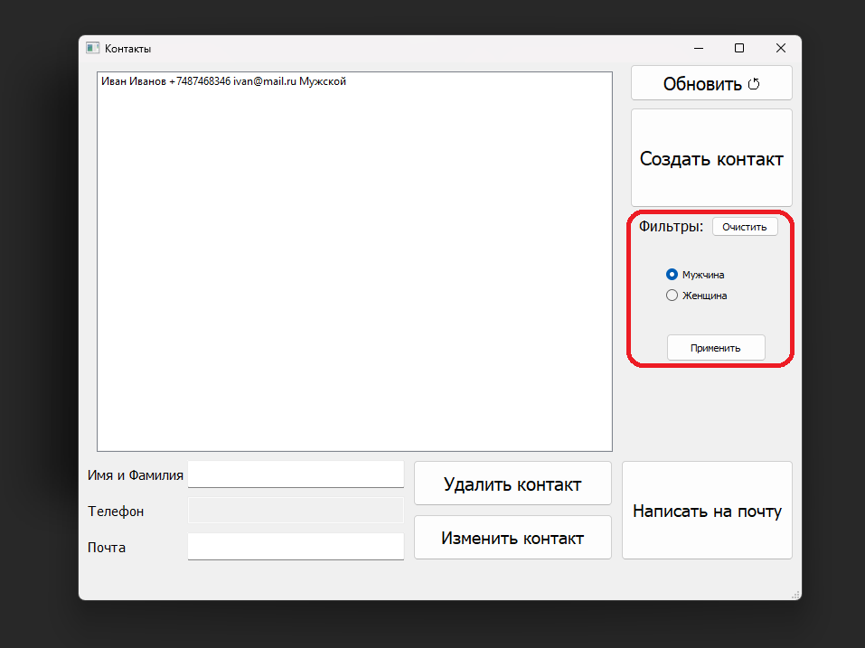
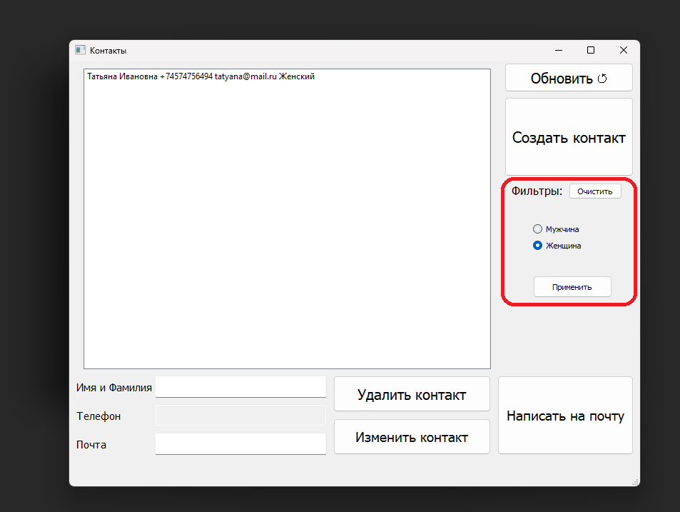
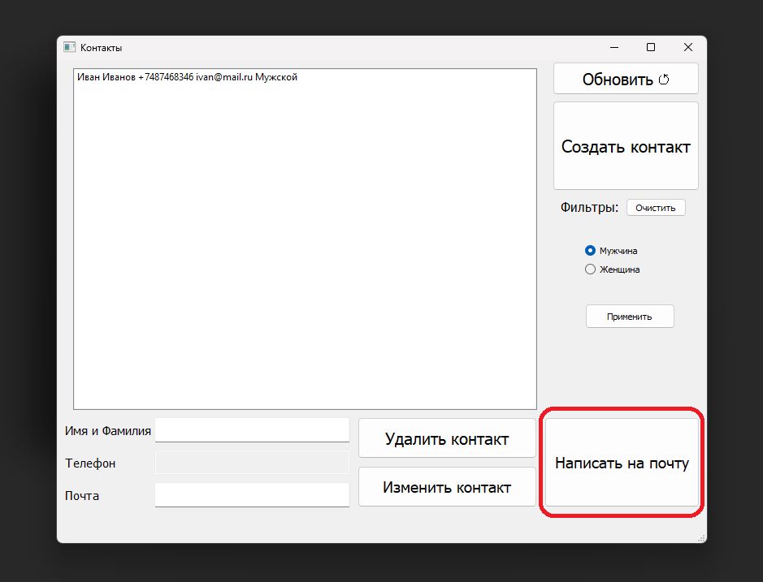
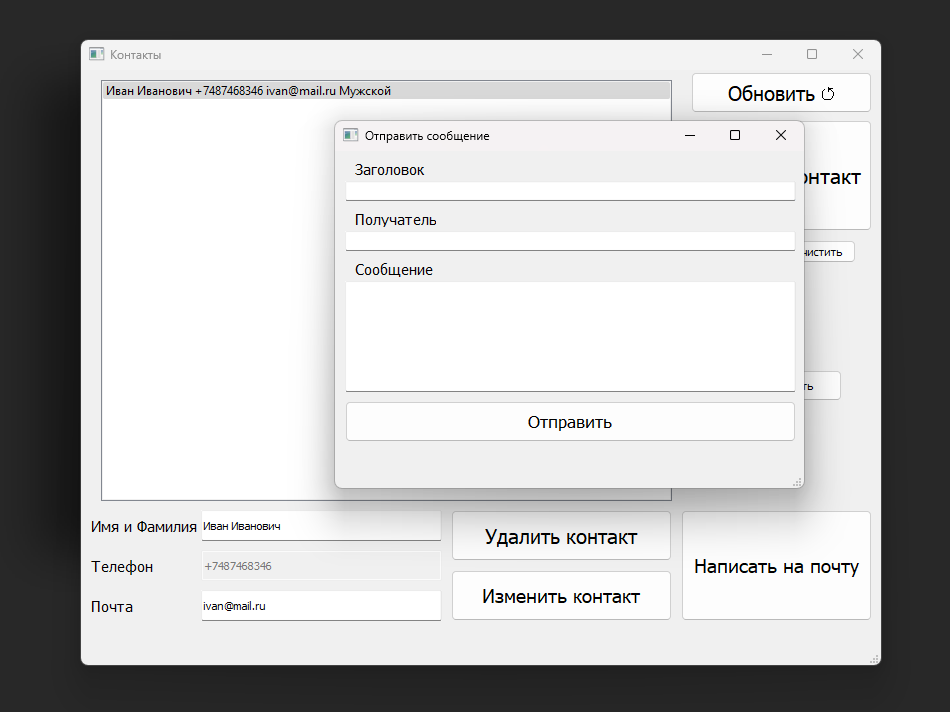

# О программе
Мой программа нужна для сохранения имён и телефонов людей. Так же с моей программы можно отправлять сообщения на почту.

# Как запустить?
Распакуйте архив с файлами программы. Запустите главную форму: main.py

# Как пользоваться?
Запустив программу, вы увидете главное окно.

Нажмите на кнопку создать контакт и вам откроется меню с возможностью создания.

Вы можете выбрать пол контакта, имя, фамилия, телефон, почта.
Вы обязательно должны указать имя и телефон.

Нажав два раза на контакт вы выберите его.
У вас есть 2 кнопки для взаимодействия с контактом. Удалить или изменить контакт.

В контактах есть функция фильтрации по полу контактов.

Последняя функции в главное меню это написать на почту.

Если вы на неё нажмёте,
то откроется окно для отправки письма человеку.